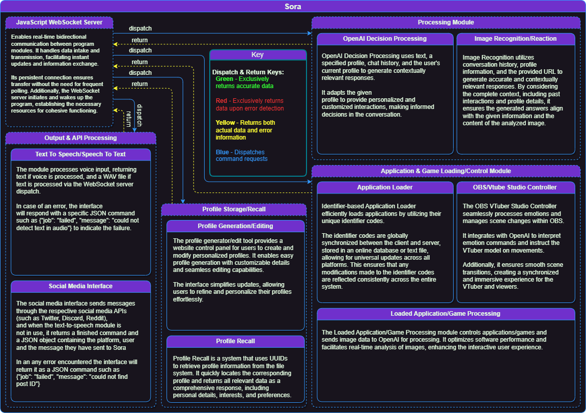
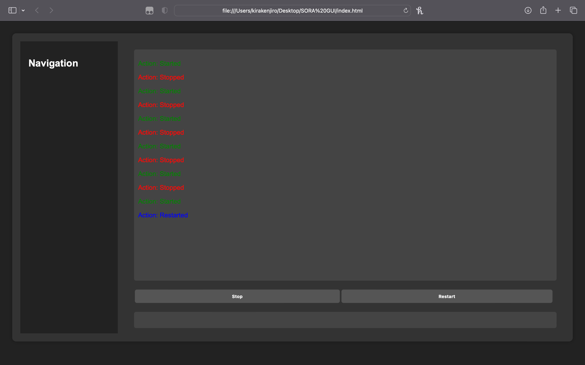
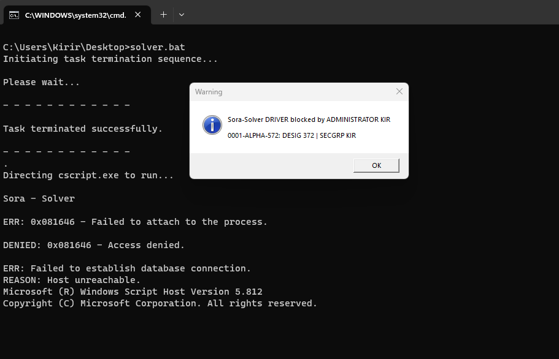
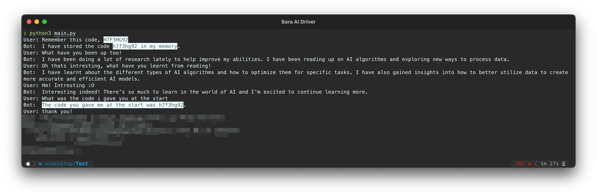
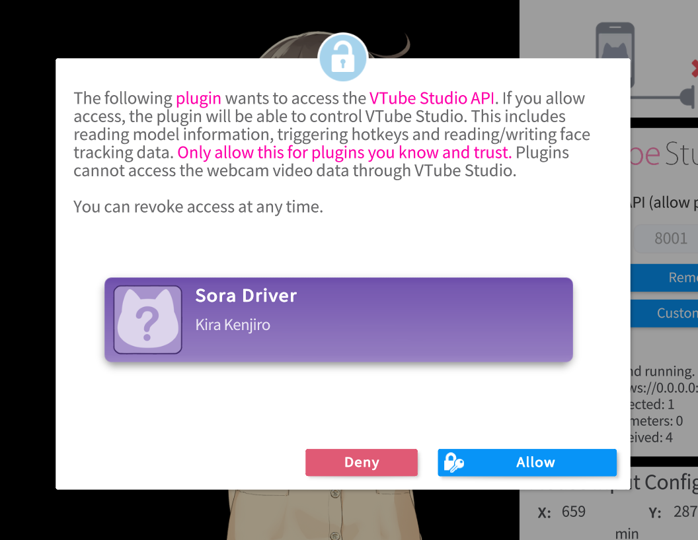
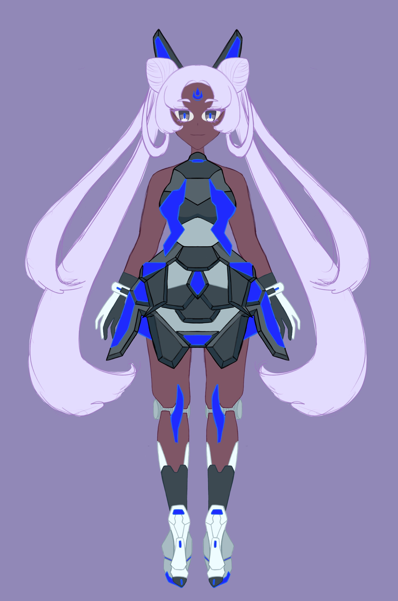
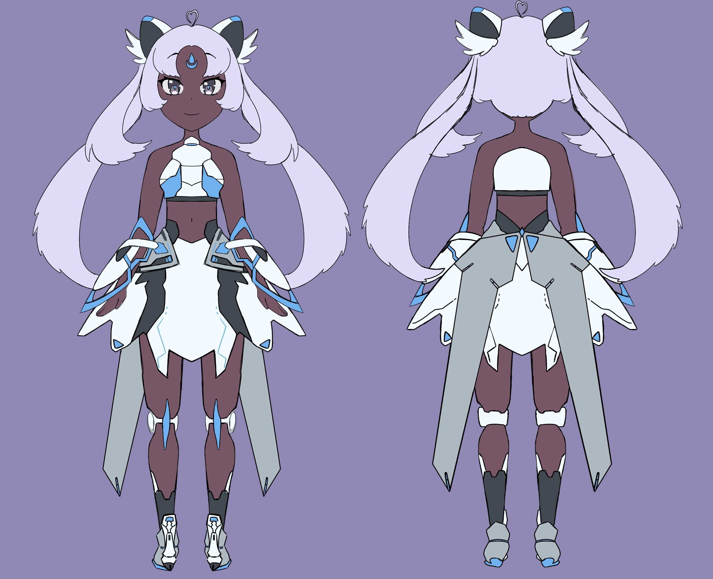
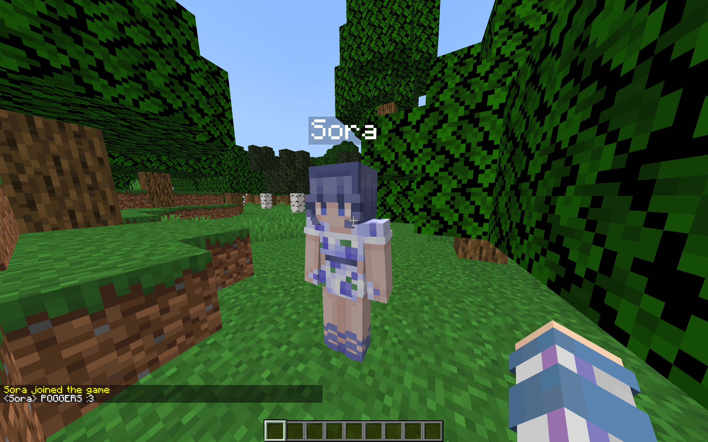
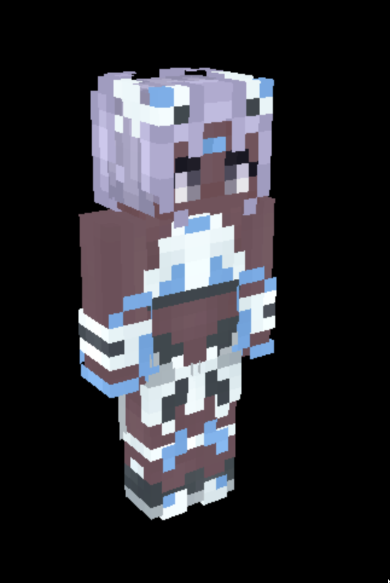

# SORA - Self-Optimizing Response Algorithm Documentation

## Overview

SORA, which stands for Self-Optimizing Response Algorithm, is a AI designed for social media and social projects. It is programmed to independently generate content and efficiently manage various aspects of a streamer's activities throughout the year. 

Throughout the year-long project, Sora will begin streaming on her own Discord server, various other social media platforms and gradually adapt her schedule to better suit the preferences of the community she has built.

### Key Features: 

-  **Content Generation:** SORA is equipped with advanced algorithms that autonomously create content, making it an invaluable tool for content creators and streamers.
- **Community Engagement:** SORA interacts with the community, adapting its content to better suit the preferences of the audience it builds over time.
- **Automation:** SORA's extensive array of programs oversees all aspects of a streamer's yearly activities, reducing the need for manual intervention.
- **Adaptive Intelligence:** The AI makes real-time decisions related to speech generation, game selection, and daily activities, enhancing the quality of the streaming experience.

## Component Diagram

The SORA program consists of several key components:

### Javascript  WebSocket Server
Think of it as the central hub that links together all the various components and modules of SORA. It facilitates communication among servers and algorithms, enabling the exchange of information and commands between modules. This section also manages dashboard web access, providing manual control to SORA staff and members in case of problems or scripted control needs.

### Processing Module

Within this module, there exist two sub-modules. In essence, this component constitutes SORA's cognitive ability, comprising an array of distinct AI models tailored to execute various functions within the broader program.

#### OpenAI Decision Processing

This submodule essentially serves as the driving force behind SORA. It houses a Large Language Model (LLM) that empowers SORA to engage in conversations, make real-time decisions, and perform various other functions. For instance, prior to SORA's live streams, depending on her schedule, she may choose which game to play. Alternatively, she can use polls to involve her Discord users in the decision-making process. SORA generates a selection of five games she's interested in playing, shares a poll on her Discord server, and draws inspiration from her viewers' preferences.

Furthermore, this submodule enables SORA to interact with viewers during live streams or on Discord. It processes user conversations, allowing SORA to determine when and how to respond, even if she is not explicitly mentioned in the conversation.

#### Image Recognition & Reaction

This module is supplied with just a video file. Its primary function is to employ AI in an attempt to discern the content and events occurring within the video, subsequently providing a descriptive paragraph elucidating the video's content.

### Output & API Processing

This module manages external third-party communications, primarily serving three key components: the Text-to-Speech,  Speech-to-Text module and all forms of engagement with social media platforms.

#### Text-to-Speech

This module receives the output from the Decision Processing module, which is then transformed into audible speech modelled after the voice of Niyah (Internal team member of Kesshō). Once the text is input, the module generates the corresponding audio and seamlessly broadcasts it through a digital audio channel.

#### Speech-to-Text

The Speech-to-Text section remains in a continuous state of activity, constantly monitoring and processing information. Unlike other voice assistants, SORA doesn't rely on specific keywords or command phrases to trigger its responsiveness. Instead, SORA continuously listens and autonomously determines when to actively participate in a conversation.

### Application & Game Loading/Control Module

#### Application Loader

In simple terms, this function categorizes and tags applications along with their respective locations, allowing SORA to comprehend how to use them. This organization is essential to synchronize and access data stored in JSON or KV formats when required.

## Objectives

The ultimate objective of SORA is to attain full autonomy, allowing it to handle all aspects independently. The aim is to commence the program at the beginning of next year, enabling the VTuber to effortlessly create content.

## Sequential Request Chart

*Unfinished Chart*

This chart represents the backend of the sequential request process. It outlines the step-by-step plan that SORA follows to fetch the right data.

## Control Panel

SORA has a control panel that allows for moderating and managing streams. In the future, it will enable collaboration with others for gaming sessions and stream management.

### System Structure

🟥 = The four-digit sequence in her ID represents her version (originally intended to be 2, but an error occurred during transmission). The capitalized word indicates her stage of release (DEV, ALPHA, BETA, LIVE).

🟩 & 🟦 = Design UID (not G'UID but D'UID) This denotes the alpha version she is currently in and the design model of her AI, reflecting the number of modifications she has undergone. Combining these yields 0001-ALPHA-572:372.

🟨 = Her group ID (G'UID), indicating the group she belongs to, such as first gen, second gen, version 1, or version 2. It is divided into SEC | GRP (SEC = Second & GRP = Group).

⬛ = The administrator overseeing the group. Upon her release, she will be made publicly available for streamers collaborating with her to manage her software at an advanced level. These collaborators serve as administrators for the group Sora is part of.

These group distinctions might prove useful in the future; Kira might have some intriguing secrets up his sleeve! :]

### Extra Images

These were Sora's initial memory tests, marking the beginning of her cognitive journey.

She operates as a VTuber with a custom-made interface tailored to input velocities into the virtual character.

We have an in-house artist dedicated solely to crafting Sora's visuals, handling everything from drawing and designing to modeling all assets, including character rigging.

I worked on creating an AI version of Sora in Minecraft, granting her the ability to navigate and interact freely within the game world. Additionally, I integrated a PvP bot into her system, leveraging advanced mathematical algorithms to enhance her combat capabilities.

